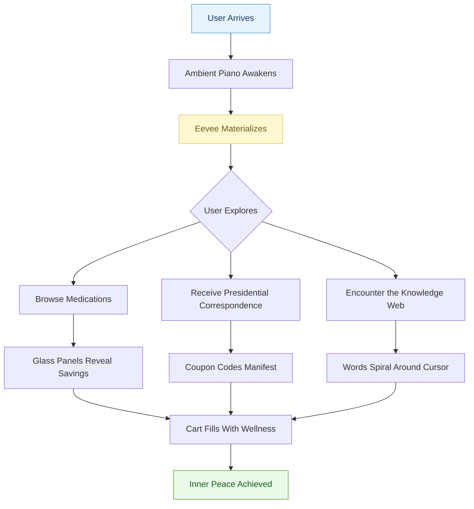
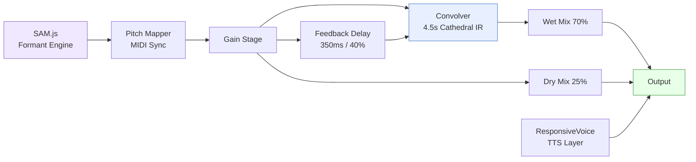
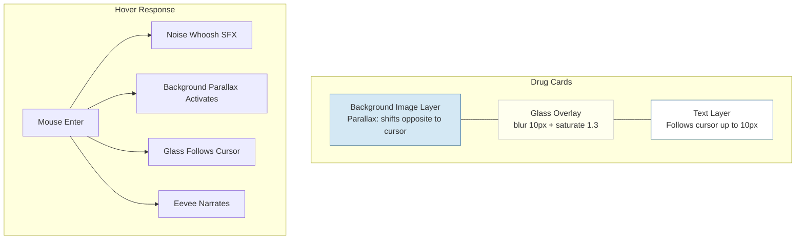
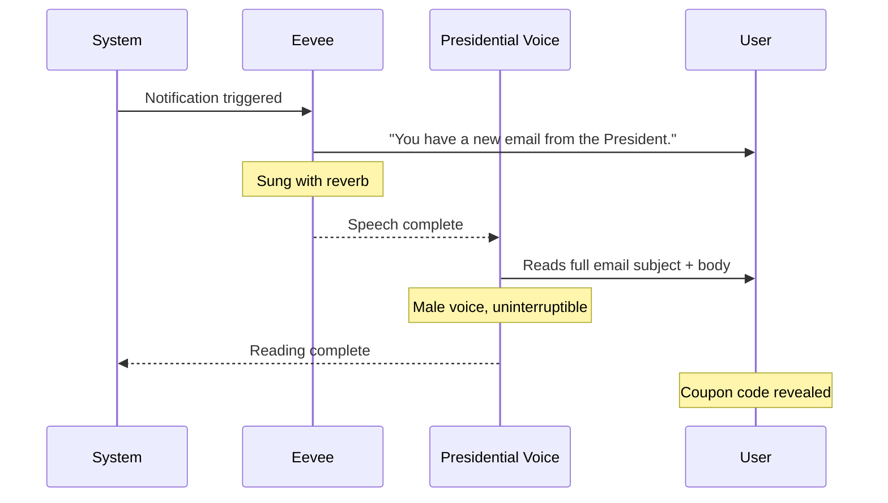

# FruitRx

### *Reimagining the Prescription Experience Through Organic Digital Wellness*

> *"Where technology meets nature, and savings bloom like wildflowers across an infinite azure desktop."*

---

**[Launch the Experience](https://williamsharkey.github.io/fruitigerAeroRx/)**

---

## The Vision

FruitRx represents a holistic brand-wide redesign of the prescription savings platform, grounded in principles of **transparency**, **organic computing**, and **aquatic serenity**. Every pixel has been crafted to evoke the feeling of sunlight filtering through crystal-clear water onto a brushed titanium surface.

Our design language draws from the golden era of human-computer harmony — when interfaces breathed, when glass was real, and when every gradient told a story about the relationship between the user and their wellness journey.

## Platform Architecture



## Eevee: Your Wellness Companion

Eevee is a next-generation AI wellness guide powered by dual-layer vocal synthesis. She communicates through a proprietary blend of **SAM.js formant synthesis** and **neural TTS**, layered simultaneously to produce an ethereal vocal texture reminiscent of cathedral acoustics.

Her voice is routed through a custom Web Audio signal chain:



Each word Eevee speaks is pitched to match the currently playing MIDI note, creating a singing effect that harmonizes with the ambient piano. The result is simultaneously intelligible and dreamlike.

## Audio Ecosystem

The ambient soundscape features classical piano rendered through a real-time MIDI engine with GM soundfont synthesis. The playlist rotates through carefully curated compositions:

| | Composer | Work |
|---|---|---|
| 1 | Satie | Gymnopedie No. 1 |
| 2 | Debussy | Clair de Lune |
| 3 | Chopin | Nocturne Op.9 No.2 |
| 4 | Chopin | Raindrop Prelude |
| 5 | Bach | Prelude in C Minor |
| 6 | Rachmaninov | Variation 18 (Paganini) |
| 7 | Satie | Gymnopedie (Cello) |
| 8 | Satie | Gymnopedie (Flute) |
| 9 | Satie | Gymnopedie (Violin) |

All MIDI data is embedded as base64 to ensure zero-latency playback with no external dependencies.

## Interactive Design System



Drug cards feature a three-layer depth system. The background image shifts in the opposite direction of the cursor. The frosted glass overlay tracks the cursor position proportionally. The combined effect produces a physical sensation of looking through a window into a verdant pharmaceutical landscape.

## Presidential Communications Module

Periodic email notifications arrive from the Executive Office, rendered in the classic Outlook 2007 notification style. Each message is read aloud by a dedicated male voice synthesis engine while Eevee provides commentary. The notification includes an official portrait and a unique algorithmically-generated coupon code.



## Technology

| Layer | Implementation |
|---|---|
| Voice Synthesis | SAM.js + ResponsiveVoice (simultaneous) |
| Audio Engine | Web Audio API, Soundfont-player, MIDI-player-js |
| Reverb | Synthetic impulse response, 4.5s decay |
| Echo | Feedback delay network, 350ms |
| Visual FX | CSS backdrop-filter, requestAnimationFrame parallax |
| Fish | Autonomous ecosystem with predation, growth, and reproduction |

## Development

```bash
# Serve locally
python3 -m http.server 8888

# Visit
open http://localhost:8888
```

No build step. No bundler. No node_modules. Just glass, gradients, and the sound of piano keys falling like rain on a sun-drenched ocean.

---

<p align="center">
  <i>FruitRx: Because your health journey deserves a soundtrack.</i>
</p>
